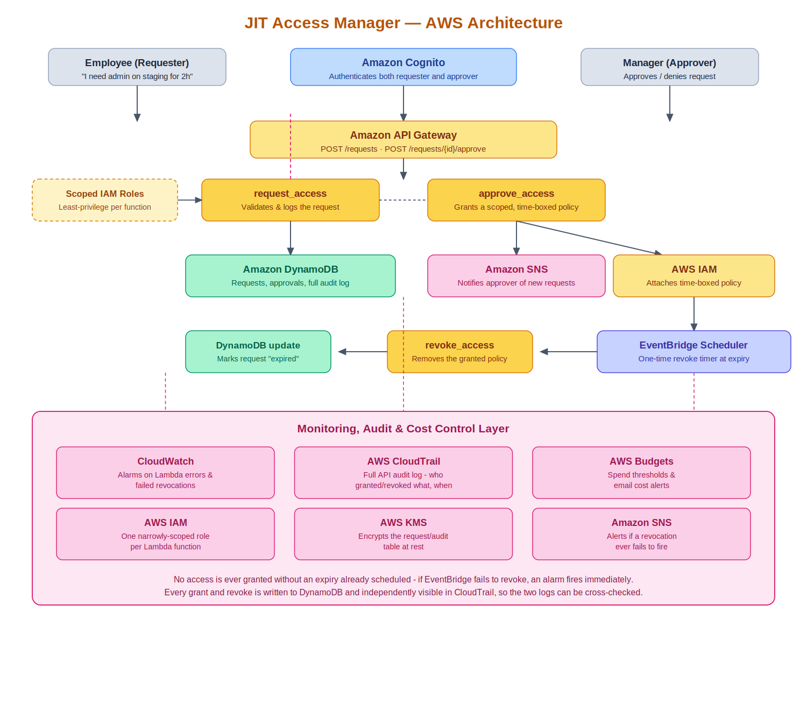

# JIT Access Manager

A just-in-time privileged access platform on AWS — Cloud Computing capstone project.

An employee requests a specific, time-boxed elevated permission. A manager
approves or denies it. If approved, the permission is granted immediately
and **automatically revoked at the exact requested expiry**, with no manual
cleanup step anyone could forget. Every request, grant, and revocation is
logged in DynamoDB, and independently visible in the account's CloudTrail
history (see note below).

> **Note on CloudTrail and Budgets:** this project doesn't deploy its own
> trail or budget. Both services operate at the AWS account level, not
> per-project, and this account already has a multi-region CloudTrail and
> a monthly Budget (originally set up for a separate project). Since they
> already capture every API call and every dollar spent account-wide, a
> second, JIT-specific trail and budget would be redundant. Confirmed by
> directly querying CloudTrail for this project's own `PutRolePolicy` and
> `DeleteRolePolicy` events — both show up correctly.

📄 Full proposal: [`docs/JIT_Access_Manager_Proposal.docx`](docs/JIT_Access_Manager_Proposal.docx)
🖥️ Frontend: [`frontend/index.html`](frontend/index.html) — a standalone dashboard, no build step required

## Why this design is safe to run in a real AWS account

Rather than accepting arbitrary IAM policy JSON from a requester (one typo
away from granting real admin), the system only ever grants from a small,
fixed **permission catalog** defined in the CloudFormation template:

- `s3-read-demo-bucket` — read-only access to one demo S3 bucket
- `dynamodb-read-requests` — read-only access to the requests table itself

Grants attach to a single, dedicated `TargetRole` that starts with **zero**
permissions. `approve_access` adds exactly one inline policy per grant;
`revoke_access` removes exactly that one policy. Nothing in this system can
ever touch any other role, user, or resource in the account.

## Architecture



```
Employee → Cognito → API Gateway → request_access → DynamoDB (pending) → SNS (notify approver)
Manager  → Cognito → API Gateway → approve_access  → IAM (grant) + EventBridge Scheduler (schedule revoke)
                                                    ↓ (at expiry, automatically)
                                        EventBridge Scheduler → revoke_access → IAM (revoke) → DynamoDB (expired)
                                                                              ↓
                                                    CloudWatch (deployed) · CloudTrail & Budgets (planned)
```

Both the employee and manager can also use `frontend/index.html` instead of
calling the API directly — see **Frontend** below.

## Status

| Phase | What it builds | Status |
|---|---|---|
| 1 — Foundation | Cognito (+ approvers group), requests table, demo bucket, target IAM role, SNS | ✅ Deployed |
| 2 — Compute | 4 Lambdas, HTTP API, Cognito authorizer, EventBridge Scheduler wiring | ✅ Deployed and tested end-to-end |
| 3 — Monitoring | CloudWatch alarm on failed revocations | ✅ Deployed and tested |
| 3 — Monitoring (cont.) | CloudTrail, AWS Budgets | ✅ Covered by an existing account-wide trail and budget (see note below) — confirmed by querying CloudTrail directly for this project's IAM events |
| Frontend | Standalone employee/manager dashboard | ✅ Built and tested |

## Repo layout

```
jit-access-cloud/
├── infra/cloudformation/
│   ├── 01-foundation.yaml    # Cognito, DynamoDB, demo bucket, target role, SNS
│   ├── 02-compute-api.yaml   # 4 Lambdas + HTTP API + Cognito authorizer + Scheduler
│   └── 03-monitoring.yaml    # CloudWatch alarm on failed revocations
├── lambda/
│   ├── request_access/       # POST /requests
│   ├── approve_access/       # POST /requests/{id}/approve — the core grant logic
│   ├── revoke_access/        # DELETE /requests/{id} (manual) + EventBridge target (automatic)
│   └── list_requests/        # GET /requests[?status=pending]
├── frontend/
│   └── index.html            # Standalone employee/manager dashboard (no build step)
├── docs/
│   ├── JIT_Access_Manager_Proposal.docx
│   ├── DEMO.md                # Full step-by-step demo walkthrough
│   └── architecture.png
```

## Prerequisites

- AWS CLI v2, configured (`aws configure`)
- Region: `us-east-1` (used throughout the commands below)

## Deploying

```bash
# Phase 1 — Foundation
aws cloudformation deploy \
  --template-file infra/cloudformation/01-foundation.yaml \
  --stack-name jit-access-dev-foundation \
  --capabilities CAPABILITY_NAMED_IAM \
  --region us-east-1

# One-time: create a bucket to hold packaged Lambda artifacts
ACCOUNT_ID=$(aws sts get-caller-identity --query Account --output text)
aws s3 mb "s3://jit-access-dev-lambda-artifacts-${ACCOUNT_ID}" --region us-east-1

# Phase 2 — Compute: package (zips each Lambda folder, uploads to S3),
# then deploy the PACKAGED template (not the original)
aws cloudformation package \
  --template-file infra/cloudformation/02-compute-api.yaml \
  --s3-bucket "jit-access-dev-lambda-artifacts-${ACCOUNT_ID}" \
  --output-template-file infra/cloudformation/02-compute-api.packaged.yaml

aws cloudformation deploy \
  --template-file infra/cloudformation/02-compute-api.packaged.yaml \
  --stack-name jit-access-dev-compute \
  --capabilities CAPABILITY_NAMED_IAM \
  --region us-east-1

# Get the API endpoint
aws cloudformation describe-stacks --stack-name jit-access-dev-compute \
  --query "Stacks[0].Outputs" --region us-east-1

# Phase 3 — Monitoring (CloudWatch alarm on failed revocations)
aws cloudformation deploy \
  --template-file infra/cloudformation/03-monitoring.yaml \
  --stack-name jit-access-dev-monitoring \
  --capabilities CAPABILITY_NAMED_IAM \
  --region us-east-1
```

## Setting up a demo requester and approver

```bash
POOL_ID=$(aws cloudformation describe-stacks --stack-name jit-access-dev-foundation \
  --query "Stacks[0].Outputs[?OutputKey=='UserPoolId'].OutputValue" --output text --region us-east-1)
CLIENT_ID=$(aws cloudformation describe-stacks --stack-name jit-access-dev-foundation \
  --query "Stacks[0].Outputs[?OutputKey=='UserPoolClientId'].OutputValue" --output text --region us-east-1)

# Requester
aws cognito-idp admin-create-user --user-pool-id $POOL_ID --username employee@example.com \
  --temporary-password '<temporary-password>' --message-action SUPPRESS --region us-east-1
aws cognito-idp admin-set-user-password --user-pool-id $POOL_ID --username employee@example.com \
  --password '<your-password>' --permanent --region us-east-1

# Approver — same steps, then add to the approvers group
aws cognito-idp admin-create-user --user-pool-id $POOL_ID --username manager@example.com \
  --temporary-password '<temporary-password>' --message-action SUPPRESS --region us-east-1
aws cognito-idp admin-set-user-password --user-pool-id $POOL_ID --username manager@example.com \
  --password '<your-password>' --permanent --region us-east-1
aws cognito-idp admin-add-user-to-group --user-pool-id $POOL_ID --username manager@example.com \
  --group-name approvers --region us-east-1
```

## Frontend

The JIT Access Manager frontend is a standalone dashboard located at
`frontend/index.html`. It requires no build step or npm installation.

### Live Demo

The frontend is publicly available through Amazon CloudFront with a custom
HTTPS domain:

**https://jit.barfs.shop**

The frontend is hosted in a private Amazon S3 bucket and delivered through
Amazon CloudFront. AWS Certificate Manager (ACM) provides the SSL/TLS
certificate for the custom domain.

CloudFront distribution:

- Distribution ID: `EWMBBAFBT5WS4`
- CloudFront domain: `dhdhrgszajmez.cloudfront.net`
- Default root object: `index.html`

The custom domain is configured through GoDaddy DNS using a CNAME record:

```text
jit.barfs.shop → dhdhrgszajmez.cloudfront.net
```

The public deployment was tested successfully with both employee and manager
login workflows.

### Local Testing

The frontend can also be tested locally with:

```bash
npx serve frontend
```

Then open `http://localhost:3000`.

The dashboard shows different sections depending on who's logged in:

- **Employee login** — "Request Temporary Access" form and "My Requests" history
- **Manager login** (must be in the `approvers` Cognito group) — "Pending Access Requests" queue and "Active Access" list with a revoke action

## Demo flow

For the full 9-step walkthrough (including IAM verification commands and
the automatic-expiry check), see [`docs/DEMO.md`](docs/DEMO.md). Quick
version:

1. Sign in as the employee (via the frontend, or `POST /requests` directly) and submit a request
2. Sign in as the manager and approve it
3. Confirm the grant is real: `aws iam list-role-policies --role-name jit-access-dev-target-role`
4. Wait for the requested duration to pass
5. Run the same IAM command again — the policy is gone, with no manual step taken
6. Check DynamoDB — the request's status moved `pending` → `active` → `expired`, each with a timestamp

## Tearing down

```bash
aws cloudformation delete-stack --stack-name jit-access-dev-monitoring --region us-east-1
aws cloudformation wait stack-delete-complete --stack-name jit-access-dev-monitoring --region us-east-1

aws cloudformation delete-stack --stack-name jit-access-dev-compute --region us-east-1
aws cloudformation wait stack-delete-complete --stack-name jit-access-dev-compute --region us-east-1

aws cloudformation delete-stack --stack-name jit-access-dev-foundation --region us-east-1
```

The Lambda artifacts bucket isn't managed by any stack — delete it manually:
`aws s3 rb s3://jit-access-dev-lambda-artifacts-<account-id> --force`

## Cost notes

Designed to run inside AWS Free Tier — everything here (Lambda, DynamoDB,
API Gateway, EventBridge Scheduler, SNS, Cognito, CloudWatch) has a generous
always-free or 12-month-free allowance. CloudFront is used for the public
frontend deployment. No NAT Gateway or customer-managed KMS key is used —
the DynamoDB table uses its default AWS-owned encryption key, which carries
no additional charge.
